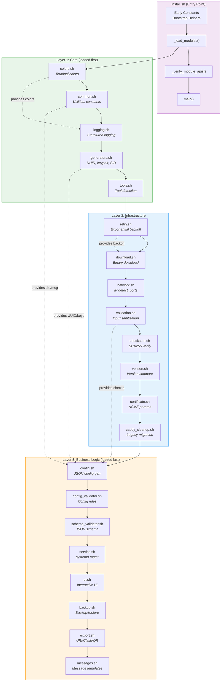
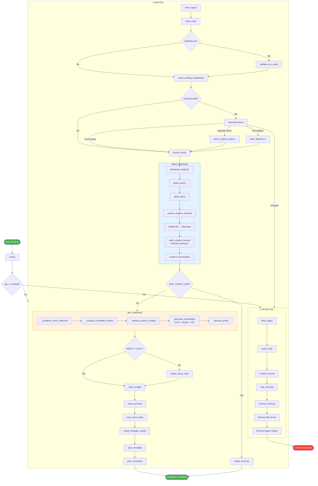
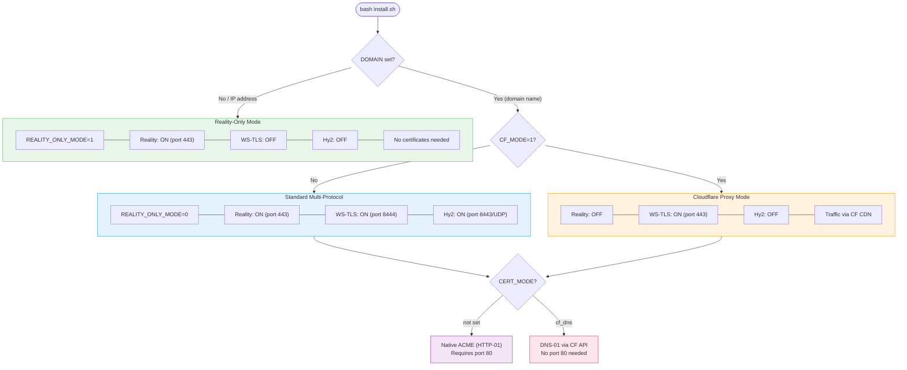
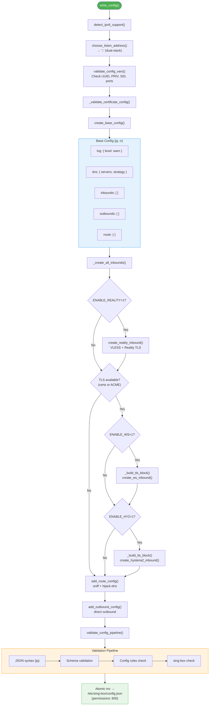
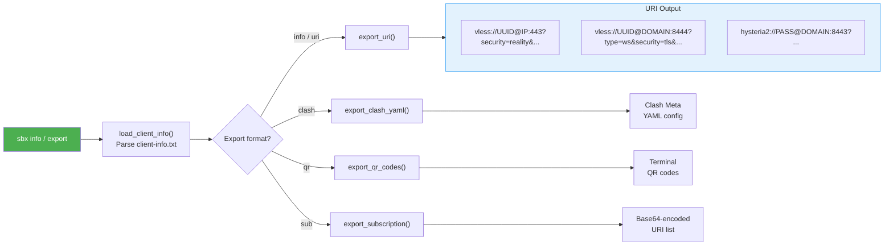
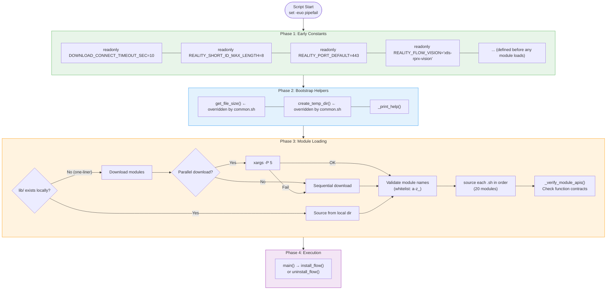

# Architecture Diagrams

Visual architecture reference for sbx-lite. All diagrams use Mermaid syntax
and render on GitHub.

**See also:** [.claude/ARCHITECTURE.md](../.claude/ARCHITECTURE.md) for the
complete module list and ASCII diagrams.

---

## Table of Contents

1. [Module Dependency Architecture](#1-module-dependency-architecture)
2. [Installation Flow](#2-installation-flow)
3. [Protocol Mode Decision Tree](#3-protocol-mode-decision-tree)
4. [Configuration Generation Flow](#4-configuration-generation-flow)
5. [Backup & Restore Flow](#5-backup--restore-flow)
6. [Client Export Flow](#6-client-export-flow)
7. [Module Loading & Bootstrap Sequence](#7-module-loading--bootstrap-sequence)
8. [sing-box Configuration Structure](#8-sing-box-configuration-structure)

---

## 1. Module Dependency Architecture

Module loading order and functional grouping. All 21 modules are loaded
sequentially by `_load_modules()` in `install.sh`.

---

## 2. Installation Flow

Complete flow from `bash install.sh` to running service.

---

## 3. Protocol Mode Decision Tree

How environment variables determine which protocols get enabled.

---

## 4. Configuration Generation Flow

How `write_config()` assembles the sing-box JSON configuration.

---

## 5. Backup & Restore Flow

How `sbx backup create` and `sbx backup restore` work.

```mermaid
flowchart TD
    subgraph CREATE["sbx backup create [--encrypt]"]
        BC1["backup_create()"] --> BC2["Collect files"]

        subgraph FILES["Backup Contents"]
            F1["/etc/sing-box/config.json"]
            F2["/etc/sing-box/client-info.txt"]
            F3["/usr/local/lib/sbx/*.sh"]
        end
        BC2 --> FILES

        FILES --> BC3["Create tar.gz archive<br/>/var/backups/sbx/"]
        BC3 --> BC4{"--encrypt?"}
        BC4 -->|Yes| BC5["openssl enc -aes-256-cbc<br/>→ .tar.gz.enc"]
        BC4 -->|No| BC6["Verify archive integrity"]
        BC5 --> BC6
    end

    subgraph RESTORE["sbx backup restore <file>"]
        BR1["backup_restore()"] --> BR2["_validate_backup_archive()"]
        BR2 --> BR3{"Encrypted?"}
        BR3 -->|Yes| BR4["_decrypt_backup()<br/>(password prompt)"]
        BR3 -->|No| BR5
        BR4 --> BR5["_prepare_rollback()<br/>Snapshot current config"]
        BR5 --> BR6["Extract → temp dir"]
        BR6 --> BR7["_apply_restored_config()<br/>sing-box check + copy"]
        BR7 --> BR8["_restore_service_state()<br/>restart + verify"]
        BR8 --> BR9{"Success?"}
        BR9 -->|Yes| BR10(["Restore Complete"])
        BR9 -->|No| BR11["Rollback to snapshot"]
    end

    style CREATE fill:#e8f5e9,stroke:#4caf50
    style RESTORE fill:#e3f2fd,stroke:#2196f3
    style FILES fill:#fff3e0,stroke:#ff9800
```

---

## 6. Client Export Flow

How `sbx info` and `sbx export` generate client configurations.

---

## 7. Module Loading & Bootstrap Sequence

Detailed view of the four-phase bootstrap process.

---

## 8. sing-box Configuration Structure

The JSON structure generated by `write_config()`.

```mermaid
graph TD
    ROOT["config.json"] --> LOG["log"]
    ROOT --> DNS["dns"]
    ROOT --> INBOUNDS["inbounds[]"]
    ROOT --> OUTBOUNDS["outbounds[]"]
    ROOT --> ROUTE["route"]

    LOG --> LOG_LEVEL["level: 'warn'"]

    DNS --> DNS_SERVERS["servers: [local]"]
    DNS --> DNS_STRATEGY["strategy: 'ipv4_only'<br/><i>(if no IPv6)</i>"]

    INBOUNDS --> IN0["[0] VLESS-Reality"]
    INBOUNDS --> IN1["[1] VLESS-WS-TLS"]
    INBOUNDS --> IN2["[2] Hysteria2"]

    subgraph REALITY["VLESS-Reality Inbound"]
        IN0 --> R_TYPE["type: vless"]
        IN0 --> R_LISTEN["listen: '::', port: 443"]
        IN0 --> R_USERS["users: [{uuid, flow: xtls-rprx-vision}]"]
        IN0 --> R_TLS["tls"]
        R_TLS --> R_ENABLED["enabled: true"]
        R_TLS --> R_SNI["server_name: 'www.microsoft.com'"]
        R_TLS --> R_REALITY["reality"]
        R_REALITY --> RR_ENABLED["enabled: true"]
        R_REALITY --> RR_PRIV["private_key: '...'"]
        R_REALITY --> RR_SID["short_id: ['a1b2c3d4']<br/><i>(8 chars max)</i>"]
        R_REALITY --> RR_HS["handshake: {server, port: 443}"]
    end

    subgraph WS["VLESS-WS-TLS Inbound"]
        IN1 --> W_TYPE["type: vless"]
        IN1 --> W_LISTEN["listen: '::', port: 8444"]
        IN1 --> W_USERS["users: [{uuid}]"]
        IN1 --> W_TRANSPORT["transport: {type: ws, path: /ws}"]
        IN1 --> W_TLS["tls: {acme or cert paths}"]
    end

    subgraph HY2["Hysteria2 Inbound"]
        IN2 --> H_TYPE["type: hysteria2"]
        IN2 --> H_LISTEN["listen: '::', port: 8443"]
        IN2 --> H_USERS["users: [{password}]"]
        IN2 --> H_TLS["tls: {alpn: [h3], acme or certs}"]
    end

    OUTBOUNDS --> OUT0["[0] {type: direct, tag: direct}"]

    ROUTE --> RULES["rules"]
    RULES --> RULE1["action: sniff"]
    RULES --> RULE2["action: hijack-dns"]

    style REALITY fill:#e8f5e9,stroke:#4caf50
    style WS fill:#e3f2fd,stroke:#2196f3
    style HY2 fill:#fff3e0,stroke:#ff9800
```

---

## Quick Reference

| Diagram | Description |
|---------|-------------|
| [Module Architecture](#1-module-dependency-architecture) | 21 modules in 3 layers with load order |
| [Installation Flow](#2-installation-flow) | Full install path from start to running service |
| [Protocol Modes](#3-protocol-mode-decision-tree) | How DOMAIN/CF_MODE determine protocols |
| [Config Generation](#4-configuration-generation-flow) | How write_config() builds JSON |
| [Backup/Restore](#5-backup--restore-flow) | Backup creation and restore with rollback |
| [Client Export](#6-client-export-flow) | URI/Clash/QR code generation |
| [Bootstrap](#7-module-loading--bootstrap-sequence) | 4-phase startup sequence |
| [Config Structure](#8-sing-box-configuration-structure) | JSON layout of config.json |
